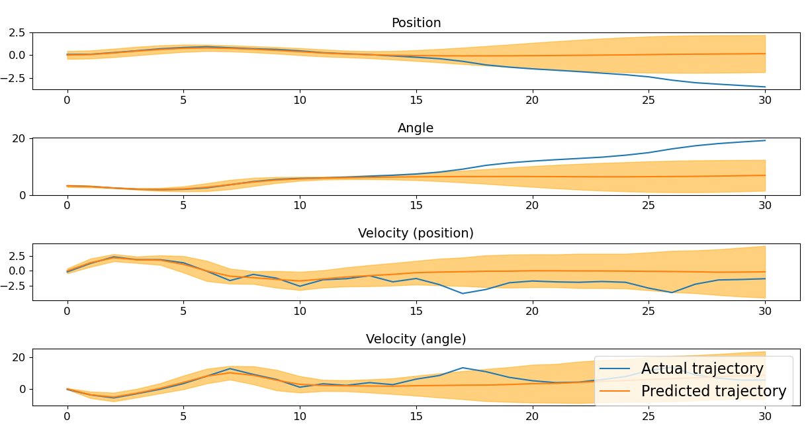

# PIPPS demo
This is a simple demo of the PIPPS algorithm implemented using the
Proppo Automatic Propagation framework. The code is intended as an
educational resource, and is not intended for applications
beyond the demo here. We intend to develop better libraries for applying
model-based reinforcement learning to other applications in future work.

## Requirements
You will need to install the proppo library; follow the instructions
at https://github.com/proppo/proppo.
If you want to use the MuJoCo cartpole, dm-control is also needed, but if this is not desired, feel free to remove the dm-control
import and comment out sections that rely on it, as dm-control is not
necessary if only the native cart-pole demo is used.
See the other requirements in requirements.txt

We recommend creating a virtual environment for the demo, e.g., using conda.

Install the requirements using
```
pip install tqdm gym==0.19.0 dm_control pyglet==1.5.19 gpytorch==1.3.1 matplotlib opencv-python
```

Note that this demo is currently based on an old version of gpytorch (1.3.1),
and will not run with newer versions. We aim to update the demo to the
newest gpytorch in the coming weeks after thorough evaluation.

## Getting started


Go into the parent directory and try the command:

```
python -m pipps.train --env pipps-cartpole-balance-v0 --record --num-opt-steps 30
```
You may also try to add the "--plot-traj" flag to plot the trajectory
predictions between trials (this compares the prediction with the actual
data, so we can check whether the predicted trajectory distribution was
realistic). See the figure below for a typical output.
Note that you will have to close the plotting window between each trial.

Different gradient estimation algorithms can be tested with
"--method name", where name can be LR, RP, TP, GR etc. for diferent methods.

LR: likelihood ratio gradients, RP: reparameterization gradients,
TP: total propagation, GR: gaussian resampling.

Gaussian shaping gradients can be tested with "--loss GS".

When the simple balancing task works, try
```
python -m pipps.train --env pipps-cartpole-swingup-v0 --record
```

For both options you may add the --gpu flag to run the code on a gpu.
The train.py file contains many possible config arguments, and different
algorithm types. Feel free to play around with different options.



## Plotting
The loss curves can be plotted with
"python -m pipps.plot_log --path path_to_csv_file", where
path_to_csv_file is the path to either cost.csv, eval_cost.csv or
dynamics_model_loss.csv. These files are stored in the logs directory for
your particular experiment. The name of the experiment can be set with
the "--id name" option.


## Issues or problems.
If you have any issues when using the software,
feel free to contact Paavo (paavo [at] sys.i.kyoto-u.ac.jp).

## Citing.
If you found this demo useful in your research then please
cite the NeurIPS paper "Proppo: a Message Passing Framework
for Customizable and Composable Learning Algorithms", and the
ICML 2018 paper: "PIPPS: Flexible Model-based Policy Search Robust to the
Curse of Chaos".

## Unit tests
Make unit tests for your changes. You can execute unit tests for the entire repository by the following command:
```
$ ./test
```

## Coding style
This repository is styled based on PEP8. You can automatically format the entire reposotory by the following command:
```
$ ./format
```

## Copyright
Copyright of Paavo Parmas. The main author is Paavo
Parmas. Takuma Seno also contributed code and knowhow to the software
engineering aspects of the project.

## Acknowledgements
This project was started under a Proof of Concept Program Grant from the
Okinawa Institute of Science and Technology (OIST) to develop a software library
based on Paavo Parmas' PhD Research at OIST.